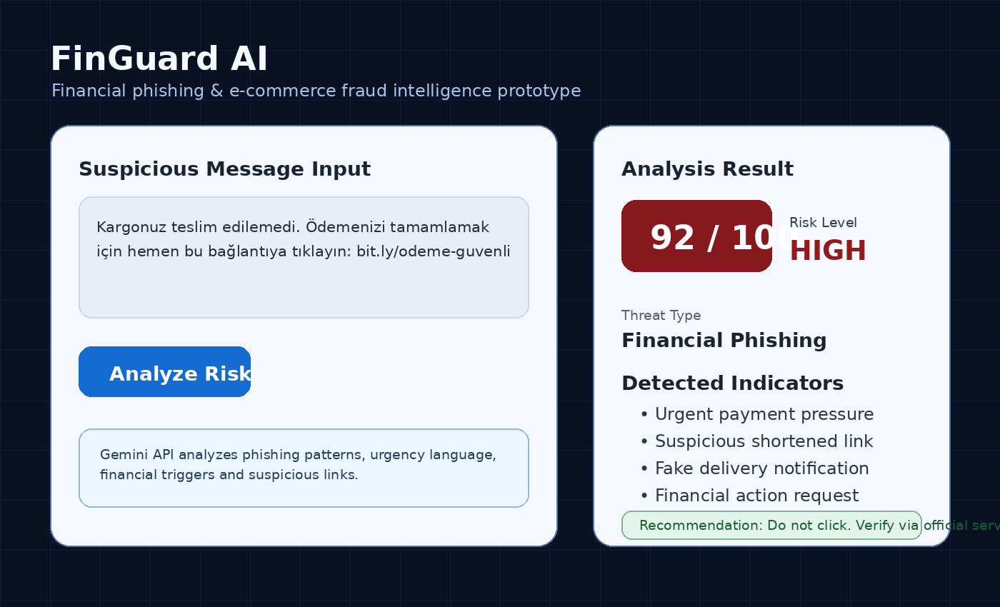

# FinGuard AI

AI Security • Fraud Detection • Turkish Scam Intelligence

FinGuard AI is an AI-powered financial phishing and fraud detection prototype focused on Turkish digital scam scenarios.

Originally prototyped during BTK Hackathon 2026.
## Product Preview



FinGuard AI analyzes suspicious Turkish financial messages and generates structured AI-powered fraud risk assessments.
---

## Problem

Digital users are frequently exposed to:

- fake payment links
- phishing messages
- fraudulent e-commerce campaigns
- fake cargo / delivery notifications
- social engineering attempts

Most users cannot quickly identify whether a message is safe or risky.

---

## Why It Matters

Financial phishing and e-commerce scams are rapidly increasing in Türkiye.

Many users cannot distinguish fraudulent messages from legitimate notifications, especially when exposed to urgency-based manipulation tactics.

FinGuard AI helps users identify risky financial communication before financial damage occurs.

## What Makes FinGuard AI Different?

Unlike generic phishing detectors, FinGuard AI focuses on Turkish financial fraud patterns, urgency-based manipulation tactics and localized scam language commonly used in Türkiye.

## Solution

FinGuard AI helps users analyze suspicious content before they click.

The system takes a suspicious message as input and returns:

- risk score
- threat category
- suspicious indicators
- explanation
- recommended security action

---

## Core Features

- AI-powered phishing analysis
- Financial fraud detection
- E-commerce scam detection
- Risk scoring system
- Threat category classification
- Security recommendation output
- Gemini API integration
- Localized Turkish scam pattern analysis

---

## Real Scam Scenarios Tested

FinGuard AI was tested against realistic Turkish phishing and financial fraud scenarios including:

- Fake cargo delivery notifications
- Marketplace payment scams
- Fraudulent IBAN transfer requests
- Fake banking verification messages
- Social engineering payment pressure attacks
- E-commerce refund scams
- Papara / bank account suspension messages

The system analyzes linguistic manipulation patterns, urgency indicators, suspicious financial requests and phishing intent signals.
## How It Works

1. User submits a suspicious financial message.
2. Backend processes the request securely.
3. AI analysis engine evaluates phishing indicators and scam patterns.
4. System generates structured threat classification.
5. Frontend dashboard visualizes the security analysis.

---

## Example Output
```json
{
  "riskScore": 92,
  "riskLevel": "HIGH",
  "threatType": "Financial Phishing",
  "detectedIndicators": [
    "Urgent payment pressure",
    "Suspicious shortened link",
    "Fake cargo notification"
  ],
  "recommendedAction": "Do not click the link. Verify through the official platform."
}
```

## Real Scam Scenarios Tested

FinGuard AI was tested against realistic Turkish phishing and financial fraud scenarios including:

- Fake cargo delivery notifications
- Marketplace payment scams
- Fraudulent IBAN transfer requests
- Fake banking verification messages
- Social engineering payment pressure attacks
- E-commerce refund scams
- Papara / bank account suspension messages

The system analyzes linguistic manipulation patterns, urgency indicators, suspicious financial requests and phishing intent signals.

---

## Live Demo

GitHub Repository:
https://github.com/busrabuseucar/finguard-ai

Video Demo:
https://youtu.be/V3h4kIcDiKU

---

## Tech Stack

Frontend:
- React
- HTML
- CSS

Backend:
- Node.js
- Express.js

AI/NLP:
- Gemini API
- Prompt-based threat analysis

---

## Project Architecture

User Input
   ↓
Backend API
   ↓
AI Threat Analysis Engine
   ↓
Structured Risk Classification
   ↓
Frontend Security Dashboard

---

## Future Improvements

- Turkish NLP fraud dataset integration
- Real-time scam intelligence feeds
- Browser extension support
- Mobile application
- Advanced fraud analytics dashboard
- Threat intelligence scoring engine
 Example Recommendation Output:

"Do not click suspicious financial links. Always verify payment or account requests through official platforms."
  "recommendation": "Do not click the link. Verify the message through the official service."
}
